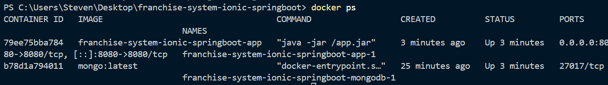

# 🚀 Franchise Management System - Backend (Reactive API)

Esta es la solución técnica para el componente de Backend, desarrollada con un enfoque en alto rendimiento, escalabilidad y principios de **Clean Architecture**.

---

## 🛠️ Stack Tecnológico

* **Lenguaje:** Java 17
* **Framework:** Spring Boot 3.x (WebFlux / Project Reactor)
* **Persistencia:** MongoDB (NoSQL) con driver reactivo
* **Contenerización:** Docker & Docker Compose
* **Infraestructura (IaC):** Terraform para aprovisionamiento de persistencia

---

## 📸 Evidencia de Funcionamiento (Screenshots)

### 1. Despliegue de Contenedores
Se utiliza Docker para garantizar la paridad entre entornos. La infraestructura incluye la API y la base de datos MongoDB:


### 2. Prueba de API (Persistence Check)
Validación de creación de franquicia mediante peticiones REST, confirmando la persistencia reactiva en MongoDB:


---

## 📦 Despliegue con Docker

Para levantar el ecosistema completo (API + DB), ejecute el siguiente comando en la raíz del proyecto:

```bash
docker-compose up -d --build
