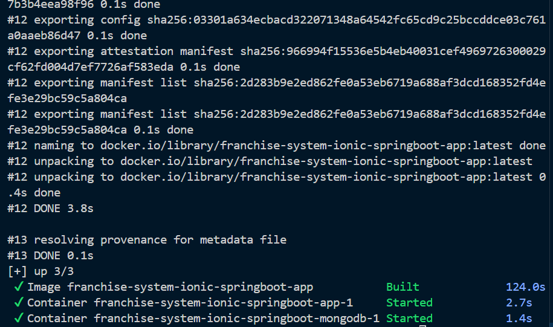

# 🚀 Franchise Management System - Backend (Reactive API)

Esta es una solución robusta para la gestión de franquicias, desarrollada bajo un paradigma **Reactivo** para garantizar alta disponibilidad y escalabilidad. El proyecto implementa **Clean Architecture** y está completamente contenerizado para despliegues agnósticos al entorno.

---

## 🛠️ Stack Tecnológico

* **Runtime:** Java 17 (OpenJDK)
* **Framework:** Spring Boot 3.4+ (Spring WebFlux)
* **Paradigma:** Programación Reactiva con Project Reactor
* **Persistencia:** MongoDB (Driver Reactivo)
* **Containerización:** Docker con Multi-stage Builds
* **Infraestructura:** Terraform para definición de recursos

---

## 📸 Evidencia Técnica (Screenshots)

### 1. Construcción Autónoma (Multi-stage Build)
El proyecto utiliza un `Dockerfile` optimizado que compila el código fuente dentro de un contenedor temporal, asegurando que el artefacto final sea ligero y seguro.


### 2. Orquestación de Servicios
Uso de **Docker Compose** para levantar el ecosistema completo. Se garantiza el aislamiento de red entre la API y la persistencia NoSQL.


### 3. Validación de Persistencia Reactiva
Prueba de integración exitosa: Creación de una franquicia mediante peticiones REST, validando el flujo No-Bloqueante de punta a punta.


---

## 📦 Guía de Despliegue Rápido

Para levantar la arquitectura completa (API + MongoDB), ejecute el siguiente comando en la raíz del proyecto:

```bash
docker-compose up -d --build
